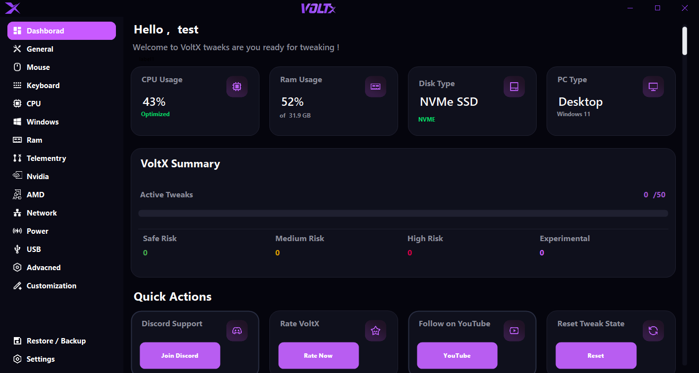

  

  

  

  <b>F*CK Windows Limits</b> 
  Unlock your PC’s true power

  VoltX transforms Windows into a performance machine — delivering lower latency, cleaner system performance, and smoother gameplay.

  
  
  
  
  

---

  

---

## What VoltX Does

VoltX optimizes Windows by removing unnecessary system overhead and applying performance tweaks designed for gamers.

**Key Improvements**

- Lower input latency
- Reduced background processes
- Improved frame stability
- Faster startup times
- Network optimization
- Automatic restore point protection

---

## Real Performance Improvements

| Metric       | Stock Windows | VoltX      |
| ------------ | ------------- | ---------- |
| CPU Usage    | 75%           | **38%**    |
| Memory Usage | 69%           | **44%**    |
| In-Game FPS  | 62 FPS        | **91 FPS** |

---

## Safety

VoltX includes **VoltX Guard** which protects your system before applying tweaks.

**Protection Features**

- Automatic restore point creation
- Safe rollback system
- Daily backup protection

---

## Requirements

- Windows 10 / Windows 11
- 64-bit system
- Administrator privileges

---

## Preview

  

---

## VoltX Is 100% Free

VoltX is **completely free to download and use**.
There are **no hidden tweaks, no locked features, and no paywalls**.

If VoltX helped you and you want to support development, you can donate via PayPal.

  

---

## Community & Links

  
  
  

---

## Disclaimer

VoltX modifies Windows configuration settings.

While designed to be safe, always ensure you create backups before applying system tweaks.

---

  VoltX by <b>Samir Masoud</b>

  

